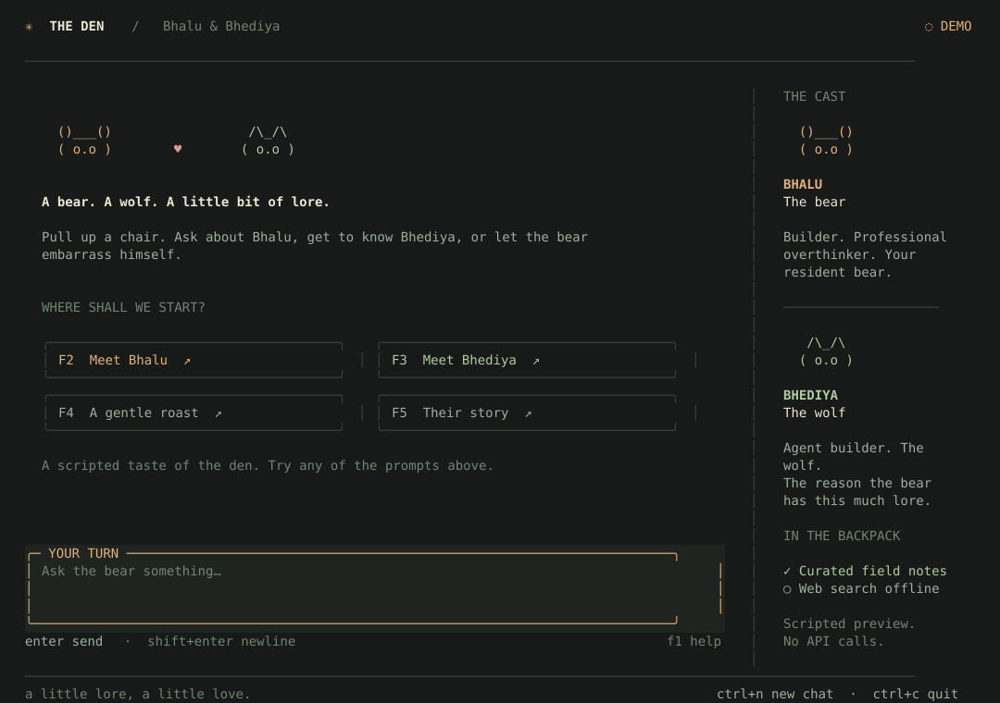

# The Den · Bhalu & Bhediya

A cozy terminal chat about a bear, a wolf, and their lore. Built with
[OpenTUI](https://opentui.com/) + React, with a Python Google ADK agent behind it.



**Bhalu** is Aditya's AI alter-ego: a builder, an enthusiastic self-roaster, and a
bear with a soft spot for **Bhediya**, Kruti Pandya. Anyone can pull up a chair and
ask about either of them. The agent uses curated tools for facts and optional Exa
search for fresh information.

## Try it

Install [uv](https://docs.astral.sh/uv/getting-started/installation/) and
[Bun](https://bun.sh/docs/installation) (tested with Bun 1.3.11). Python 3.10+
is supported; the repository defaults to 3.13. Use a modern terminal with true
color. The layout adapts from 60×24 to a wide view with character cards at 105×38+.

From the repository root:

```bash
uv sync --frozen
cd tui-chat-agent
bun install --frozen-lockfile
bun run demo
```

Demo mode is a **scripted preview**, visibly labeled in the app. It exercises the
same Python bridge, streamed rendering, tools display, and controls without API
calls. Try the starter prompts to meet both characters.

## Live chat

Create `.env` in the repository root from `.env.example` and add your keys:

| Key | Required? | Where to get it |
| --- | --- | --- |
| `GOOGLE_API_KEY` | Yes, for live chat | [Google AI Studio](https://aistudio.google.com/apikey) |
| `EXA_API_KEY` | Optional, for web search | [Exa dashboard](https://dashboard.exa.ai/api-keys) |

Then, from `tui-chat-agent`:

```bash
bun start
```

The bridge loads the repo-root `.env`; keys stay in the Python process. Without a
Google key, the UI shows setup guidance. Without an Exa key, the agent can still
use its curated notes and reports live search as offline. Search errors are
returned to the agent so it can explain the limitation.

## Make yourself at home

- **Enter** sends; **Shift+Enter** or **Ctrl+J** adds a line. Multiline paste works.
- **F2–F5**, or click a starter, to fill the composer with a suggested question.
- **Esc** stops the current reply. You can draft your next message while Bhalu
  talks; Enter waits until that reply finishes, so messages cannot overlap.
- **Page Up / Page Down** or the mouse wheel scrolls the conversation. New text
  follows the bottom unless you have scrolled up.
- **Ctrl+N** or `/new` starts a fresh chat and clears this session's history.
- **F1** or `/help` shows the shortcuts. **Ctrl+C** or `/quit` exits.

Conversations live in memory and disappear when the app closes. No local chat
files are written. In live mode, messages and tool results go to Google; Exa
receives search queries when the agent uses web search. Curated notes are
snapshots, not guarantees of current facts; a search index may not have every
LinkedIn profile or X post.

## What this sample teaches

```text
OpenTUI + React  ← JSON lines →  bridge.py  →  ADK Runner
                                              ├─ get_aditya_profile
                                              ├─ get_aditya_lore
                                              ├─ get_bhediya_dossier
                                              └─ search_web (async HTTPX → Exa)
```

- **Custom function tools:** ADK builds schemas from Python signatures and docstrings.
- **A custom frontend:** Bun owns the terminal; one Python subprocess owns the ADK
  session. There is no HTTP server or port to configure.
- **Streaming and lifecycle:** replies and tool activity stream as typed events.
  Stopping or failing a turn restores the last completed ADK session, avoiding
  dangling function calls on the next turn. This rollback is for these read-only
  tools; it cannot undo external side effects in tools you add yourself.
- **Persona via instructions:** the character lives in `bhalu_agent/agent.py`.

The standard ADK runners also work from this directory:

```bash
uv run adk run bhalu_agent
uv run adk web
```

## Verification

From the repository root:

```bash
uv run --frozen python -m unittest discover -s tui-chat-agent/tests -p 'test_*.py' -v
cd tui-chat-agent
bun run typecheck
bun test
```

Tests cover native OpenTUI rendering, keyboard controls, narrow layouts, paste,
scrolling, stream state, the real Python subprocess, Exa errors, and ADK history
after cancelling a tool call. All automated tests are offline; live model quality
and API credentials require a manual check. GitHub Actions runs the suite on
Python 3.10 and 3.13.

Regenerate the renderer-captured previews with `bun run preview` and
`bun run preview 60 24`. [Compact preview](docs/preview-60.svg).
